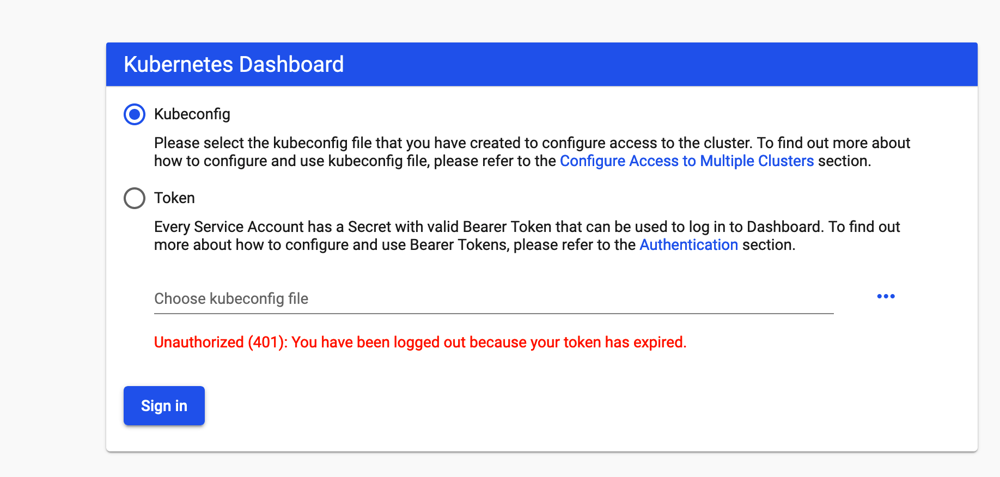
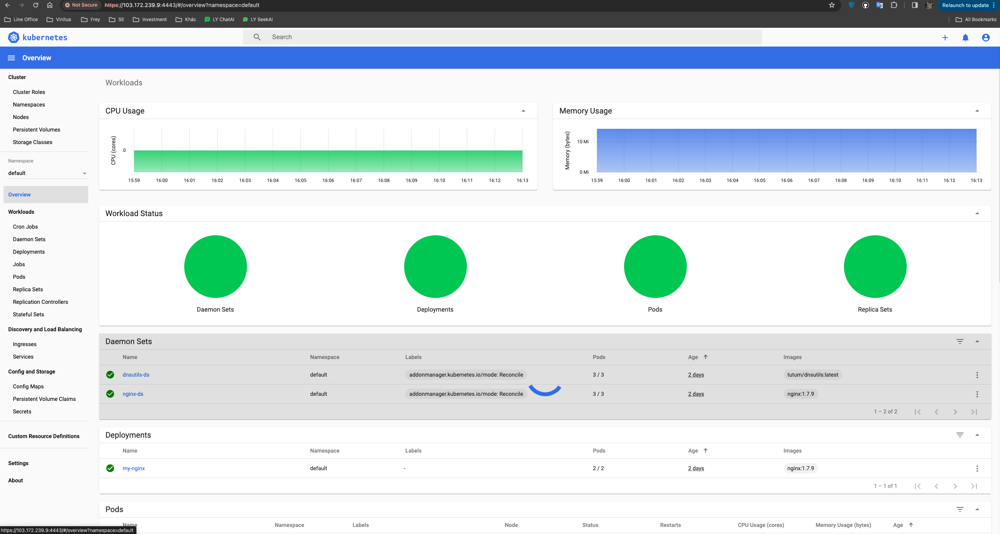

tags: addons, dashboard

# 08-3. Deploy dashboard plug-in

<!-- TOC -->

- [08-3. Deploy dashboard plug-in](#08-3-Deployment-dashboard-plug-in)
     - [Download and modify configuration files](#Download and modify configuration files)
     - [Execute all definition files](#Execute all definition files)
     - [View running status](#View running status)
     - [visit dashboard](#visit-dashboard)
         - [Access dashboard through port forward](#Access-dashboard through-port-forward-)
     - [Create token and kubeconfig configuration file for logging in to Dashboard](#Create token-and-kubeconfig-config file for login-dashboard-)
         - [Create login token](#create login-token)
         - [Create a KubeConfig file using token](#Create a -kubeconfig-file using -token-)
     - [reference](#reference)

<!-- /TOC -->

Unless otherwise specified, all operations in this document are performed on the idc-k8s-01 node;

## Download and modify configuration files

``` bash
cd /opt/k8s/work
wget https://raw.githubusercontent.com/kubernetes/dashboard/v2.0.0-rc4/aio/deploy/recommended.yaml
mv  recommended.yaml dashboard-recommended.yaml
```

## Execute all definition files

``` bash
cd /opt/k8s/work
kubectl apply -f  dashboard-recommended.yaml
```

## Check the running status

``` bash
$ kubectl get pods -n kubernetes-dashboard 
NAME                                         READY   STATUS    RESTARTS   AGE   IP              NODE         NOMINATED NODE   READINESS GATES
dashboard-metrics-scraper-7b8b58dc8b-m74cf   1/1     Running   0          38s   172.30.140.68   idc-k8s-02   <none>           <none>
kubernetes-dashboard-6cfc8c4c9-44vdk         1/1     Running   0          38s   172.30.73.69    idc-k8s-03   <none>           <none>
```
## Fix tls error
https://github.com/kubernetes/dashboard/issues/2995#issuecomment-551309479
```bash
2024/04/02 09:14:28 http: TLS handshake error from 127.0.0.1:46036: remote error: tls: unknown certificate
```

```bash
cd /opt/k8s/work
mkdir certs
# Generate Certs
openssl req -nodes -newkey rsa:2048 -keyout certs/dashboard.key -out certs/dashboard.csr -subj "/C=/ST=/L=/O=/OU=/CN=kubernetes-dashboard"
openssl x509 -req -sha256 -days 365 -in certs/dashboard.csr -signkey certs/dashboard.key -out certs/dashboard.crt
```

```bash
cd /opt/k8s/work/certs
cat dashboard.crt | base64 | tr -d '\n'
LS0tLS1CRUdJTi.....
cat dashboard.key | base64 | tr -d '\n
LS0tLS1CRUdJTiBQU...
```

```bash
kubectl edit secrets kubernetes-dashboard-certs

# Please edit the object below. Lines beginning with a '#' will be ignored,
# and an empty file will abort the edit. If an error occurs while saving this file will be
# reopened with the relevant failures.
#
apiVersion: v1
data:
  dashboard.crt: LS0tLS1C...
  dashboard.key: LS0tLS1...

# To refresh secrets
kubectl delete pod kubernetes-dashboard-6cfc8c4c9-44vdk -n kubernetes-dashboard
```

## Access dashboard

Starting from 1.7, the dashboard only allows access through https. If using kube proxy, it must listen on localhost or 127.0.0.1. There is no such restriction for NodePort, but it is only recommended for use in development environments. For login access that does not meet these conditions, the browser will not jump after successful login and will always stop at the login interface**.

### Access dashboard through port forward

Start port forwarding:

``` bash
[root@idc-k8s-01 work] kubectl port-forward -n kubernetes-dashboard  svc/kubernetes-dashboard 4443:443 --address 0.0.0.0
```

Browser access URL: `https://103.172.239.9:4443`



## Create token and kubeconfig configuration file for logging in to Dashboard

The dashboard only supports token authentication by default (client certificate authentication is not supported), so if you use the Kubeconfig file, you need to write the token to the file.

### Create login token

``` bash
kubectl create sa dashboard-admin -n kube-system
kubectl create clusterrolebinding dashboard-admin --clusterrole=cluster-admin --serviceaccount=kube-system:dashboard-admin
ADMIN_SECRET=$(kubectl get secrets -n kube-system | grep dashboard-admin | awk '{print $1}')
DASHBOARD_LOGIN_TOKEN=$(kubectl describe secret -n kube-system ${ADMIN_SECRET} | grep -E '^token' | awk '{print $2}')
echo ${DASHBOARD_LOGIN_TOKEN}
```

```
[root@idc-k8s-01 ~]# echo ${DASHBOARD_LOGIN_TOKEN}
eyJhbGciOiJSUzI1NiIsImtpZCI6IkU0aHVrYzRqY0J5RTh5LUdSVURVZkwzOWpHRlpuSVhZd2VIN1dkeXRCU0UifQ.eyJpc3MiOiJrdWJlcm5ldGVzL3NlcnZpY2VhY2NvdW50Iiwia3ViZXJuZXRlcy5pby9zZXJ2aWNlYWNjb3VudC9uYW1lc3BhY2UiOiJrdWJlLXN5c3RlbSIsImt1YmVybmV0ZXMuaW8vc2VydmljZWFjY291bnQvc2VjcmV0Lm5hbWUiOiJkYXNoYm9hcmQtYWRtaW4tdG9rZW4td2h0a2oiLCJrdWJlcm5ldGVzLmlvL3NlcnZpY2VhY2NvdW50L3NlcnZpY2UtYWNjb3VudC5uYW1lIjoiZGFzaGJvYXJkLWFkbWluIiwia3ViZXJuZXRlcy5pby9zZXJ2aWNlYWNjb3VudC9zZXJ2aWNlLWFjY291bnQudWlkIjoiYWE3YzM0NTYtOGViOC00MjRhLTliNGYtNWRhZGRkZDU4Yzg2Iiwic3ViIjoic3lzdGVtOnNlcnZpY2VhY2NvdW50Omt1YmUtc3lzdGVtOmRhc2hib2FyZC1hZG1pbiJ9.0F351V4ZYe4c6_VhdFAErm6j_bUoC3ucZpnJTRkNXoj-NGWtNTKCadZVaUgC0s_AsTyHWDX2eKuT6xlZsyLVNiq_o2kFdcaEqJzo60EF5An1W53UzYvdDMZFLv3C7bwovM6axUJ3-Io8EnywixxGaY9uw3lvsmop7aCqIDP53rIv23X0egcObPFZKxvGLAlOVurouMFaHec-uj9XLvRbokufHoaccxAfW8VSor8uO7mgoSqtAjVb58f5d3agAunXNrkVTywuyhSNzXCJw97BZTNPnAhWd7A4WGOxXXev7IpwcMHMVc9aWjFGNA1kjvHUp6G6jINfhKi5iwIPsGyDjg
```

Use the output token to log in to Dashboard.

### Create a KubeConfig file using token

``` bash
source /opt/k8s/bin/environment.sh
# Set cluster parameters
kubectl config set-cluster kubernetes \
  --certificate-authority=/etc/kubernetes/cert/ca.pem \
  --embed-certs=true \
  --server=${KUBE_APISERVER} \
  --kubeconfig=dashboard.kubeconfig

#Set client authentication parameters and use the Token created above
kubectl config set-credentials dashboard_user \
  --token=${DASHBOARD_LOGIN_TOKEN} \
  --kubeconfig=dashboard.kubeconfig

# Set context parameters
kubectl config set-context default \
  --cluster=kubernetes \
  --user=dashboard_user \
  --kubeconfig=dashboard.kubeconfig

# Set default context
kubectl config use-context default --kubeconfig=dashboard.kubeconfig

[root@idc-k8s-01 ~]# ls dashboard.*
dashboard.kubeconfig

~ ❯ scp root@103.172.239.9:/root/dashboard.kubeconfig ~/Desktop/    х 255 48m 22s Py base 16:26:27
dashboard.kubeconfig                                             100% 3019    52.9KB/s   00:00
```

Log in to the Dashboard using the generated dashboard.kubeconfig.



## Reference

1. https://github.com/kubernetes/dashboard/wiki/Access-control
2. https://github.com/kubernetes/dashboard/issues/2558
3. https://kubernetes.io/docs/concepts/configuration/organize-cluster-access-kubeconfig/
4. https://github.com/kubernetes/dashboard/wiki/Accessing-Dashboard---1.7.X-and-above
5. https://github.com/kubernetes/dashboard/issues/2540
