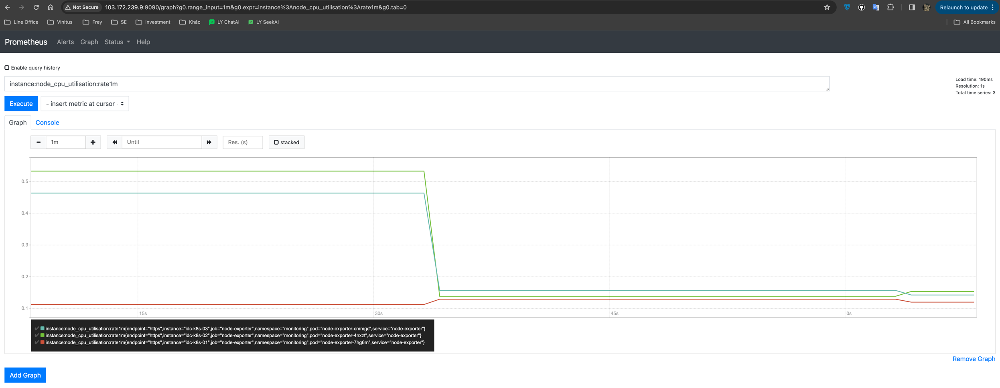
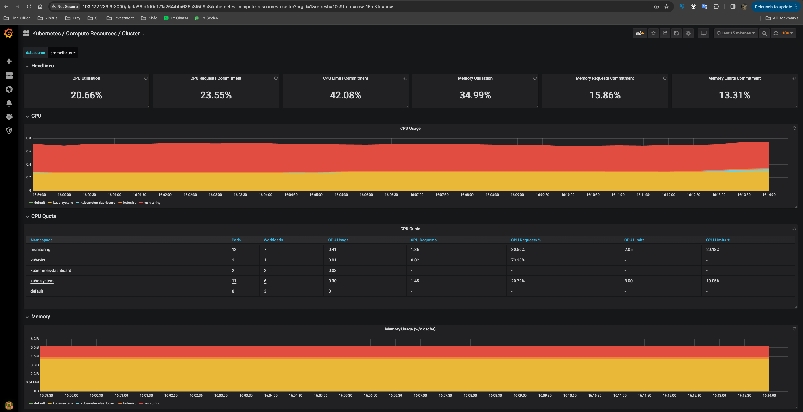

tags: addons, kube-prometheus, prometheus, grafana

# 08-4. Deploy kube-prometheus plug-in
<!-- TOC -->

- [08-4. Deploy kube-prometheus plug-in] (#08-4-deployment-kube-prometheus-plug-in)
     - [Download and Install](#Download&Install)
     - [View running status](#View running status)
     - [Access Prometheus UI](#Access-prometheus-ui)
     - [Access Grafana UI](#access-grafana-ui)

<!-- /TOC -->

kube-prometheus is a complete set of monitoring solutions. It uses Prometheus to collect cluster indicators and Grafana for display. It includes the following components:
+ The Prometheus Operator
+ Highly available Prometheus
+ Highly available Alertmanager
+ Prometheus node-exporter
+ Prometheus Adapter for Kubernetes Metrics APIs (k8s-prometheus-adapter)
+ kube-state-metrics
+ Grafana

Among them, k8s-prometheus-adapter uses Prometheus to implement metrics.k8s.io and custom.metrics.k8s.io APIs, so there is no need to deploy `metrics-server`.
If you want to deploy `metrics-server` separately, please refer to: [C.metrics-server plug-in.md](C.metrics-server plug-in.md)

Unless otherwise specified, all operations in this document are performed on the zhangjun-k8s-01 node;

## Download and install

``` bash
cd /opt/k8s/work
git clone https://github.com/coreos/kube-prometheus.git
cd kube-prometheus/
git checkout v0.4.0 --force # compatible with kubernetes verion 1.16.6
sed -i -e 's_quay.io_quay.mirrors.ustc.edu.cn_' manifests/*.yaml manifests/setup/*.yaml # Use the Registry of the University of Science and Technology of China
kubectl apply -f manifests/setup # Install prometheus-operator
kubectl apply -f manifests/ # Install promethes metric adapter
```

## Check the running status

``` bash
$ kubectl get pods -n monitoring
NAME                                   READY   STATUS    RESTARTS   AGE
alertmanager-main-0                    2/2     Running       0          63s
alertmanager-main-1                    2/2     Running       0          63s
alertmanager-main-2                    2/2     Running       0          63s
grafana-76b8d59b9b-nd6gk               1/1     Running       0          11m
kube-state-metrics-67b7c5dc78-sktzg    3/3     Running       0          73s
node-exporter-prsvf                    2/2     Running       0          34s
node-exporter-qdh6n                    2/2     Running       0          71s
node-exporter-z6h4z                    2/2     Running       0          69s
prometheus-adapter-5f46ccd66d-bbsns    1/1     Running       0          73s
prometheus-k8s-0                       3/3     Running       1          53s
prometheus-k8s-1                       3/3     Running       1          53s
prometheus-operator-6d8b95b467-htx56   1/1     Running       0          74s
```

``` bash
$ kubectl top pods -n monitoring
NAME                                  CPU(cores)   MEMORY(bytes)   
alertmanager-main-0                    0m           18Mi            
alertmanager-main-1                    2m           20Mi            
alertmanager-main-2                    0m           19Mi            
grafana-76b8d59b9b-nd6gk               4m           49Mi            
kube-state-metrics-67b7c5dc78-sktzg    11m          29Mi            
kube-state-metrics-959876458-cjtr5     9m           37Mi            
node-exporter-prsvf                    4m           11Mi            
node-exporter-qdh6n                    1m           20Mi            
node-exporter-z6h4z                    5m           11Mi            
prometheus-adapter-5f46ccd66d-bbsns    0m           17Mi            
prometheus-k8s-0                       15m          190Mi           
prometheus-k8s-1                       6m           199Mi           
prometheus-operator-6d8b95b467-htx56   0m           20Mi   
```

## Access Prometheus UI

Start the service agent:

``` bash
$ kubectl port-forward --address 0.0.0.0 pod/prometheus-k8s-0 -n monitoring 9090:9090
Forwarding from 0.0.0.0:9090 -> 9090
```
+ port-forward depends on socat.

Browser access：http://103.172.239.9:9090/graph?g0.range_input=1m&g0.expr=instance%3Anode_cpu_utilisation%3Arate1m&g0.tab=0




## Access Grafana UI

Start the agent:

``` bash
$ kubectl port-forward --address 0.0.0.0 svc/grafana -n monitoring 3000:3000 
Forwarding from 0.0.0.0:3000 -> 3000
```

Browser access: http://172.27.138.251:3000/

Log in with admin/admin:

1Dc@123@idc2024

Then, you can see various predefined dashboards:


