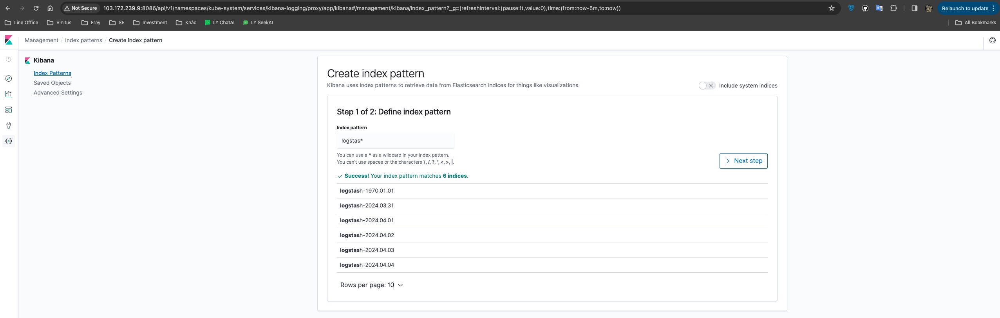
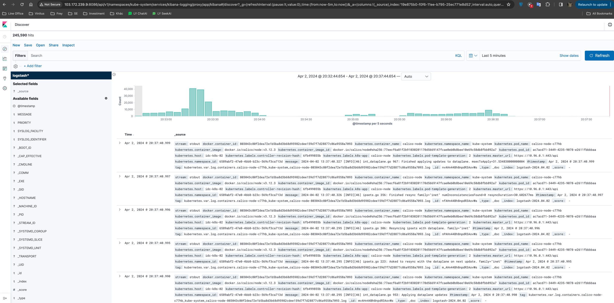

tags: addons, EFK, fluentd, elasticsearch, kibana

# 08-5. Deploy EFK plug-in

<!-- TOC -->

- [08-5. Deploy EFK plug-in] (#08-5-deploy-efk-plug-in)
     - [Modify configuration file](#Modify configuration file)
     - [Execution definition file](#Execution definition file)
     - [Check execution results](#check execution results)
     - [Access kibana through kubectl proxy](#Access-kibana through-kubectl-proxy-access)

<!-- /TOC -->

Notice:
1. Unless otherwise specified, all operations in this document are performed on the idc-k8s-01 node.
2. The manifests yaml file of kuberntes' own plug-in uses gcr.io's docker registry, which is blocked in China and needs to be manually replaced with other registry addresses;
3. You can download the blocked mirror from [gcr.io free proxy](http://mirror.azure.cn/help/gcr-proxy-cache.html) provided by Microsoft China;

## Modify configuration file

After decompressing the downloaded kubernetes-server-linux-amd64.tar.gz, decompress the kubernetes-src.tar.gz file.
``` bash
cd /opt/k8s/work/kubernetes/
tar -xzvf kubernetes-src.tar.gz
```

The EFK directory is `kubernetes/cluster/addons/fluentd-elasticsearch`。

``` bash
cd /opt/k8s/work/kubernetes/cluster/addons/fluentd-elasticsearch
sed -i -e 's_quay.io_quay.mirrors.ustc.edu.cn_' es-statefulset.yaml # Use the Registry of the University of Science and Technology of China
sed -i -e 's_quay.io_quay.mirrors.ustc.edu.cn_' fluentd-es-ds.yaml # Use the Registry of the University of Science and Technology of China
```

## Execution definition file

``` bash
cd /opt/k8s/work/kubernetes/cluster/addons/fluentd-elasticsearch
kubectl apply -f .
```

## Check execution results

``` bash
$ kubectl get all -n kube-system |grep -E 'elasticsearch|fluentd|kibana'
pod/elasticsearch-logging-0                    1/1     Running   0          4m57s
pod/elasticsearch-logging-1                    1/1     Running   0          3m21s
pod/fluentd-es-v2.7.0-25xnm                    1/1     Running   0          4m56s
pod/fluentd-es-v2.7.0-7jnr8                    1/1     Running   0          4m56s
pod/fluentd-es-v2.7.0-lpt9m                    1/1     Running   0          4m56s
pod/kibana-logging-75888755d6-fd5sr            1/1     Running   3          4m56s
service/elasticsearch-logging   ClusterIP   10.96.58.95    <none>        9200/TCP                 4m57s
service/kibana-logging          ClusterIP   10.96.243.42   <none>        5601/TCP                 4m56s
daemonset.apps/fluentd-es-v2.7.0   3         3         3       3            3           <none>                   4m56s
deployment.apps/kibana-logging            1/1     1            1           4m56s
replicaset.apps/kibana-logging-75888755d6            1         1         1       4m56s
statefulset.apps/elasticsearch-logging   2/2     4m57s
```

When kibana Pod is started for the first time, it will take a long time (0-20 minutes) to optimize and cache the status page. You can tailf the Pod's log to observe the progress:

``` bash
$ kubectl logs kibana-logging-75888755d6-fd5sr -n kube-system -f
```

Note: The browser can view the kibana dashboard only after the Kibana pod is started, otherwise it will be rejected.

## Access kibana through kubectl proxy

Create a proxy:

``` bash
$ kubectl proxy --address='103.172.239.9' --port=8086 --accept-hosts='^*$'
Starting to serve on 103.172.239.91:8086
```

Browser access URL: `http://103.172.239.9:8086/api/v1/namespaces/kube-system/services/kibana-logging/proxy`
    
Create an index (equivalent to a database in mysql) on the Management -> Indices page, select `Index contains time-based events`, use the default `logstash-*` pattern, and click `Create`;



After creating the Index, wait a few minutes and you can see the logs aggregated in ElasticSearch logging under the `Discover` menu;

