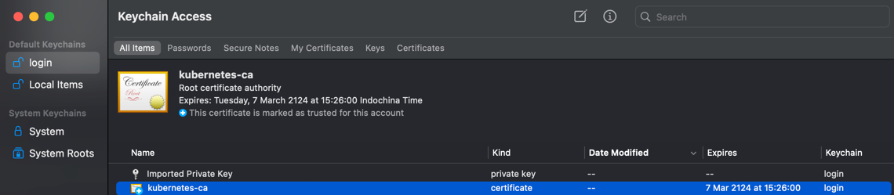
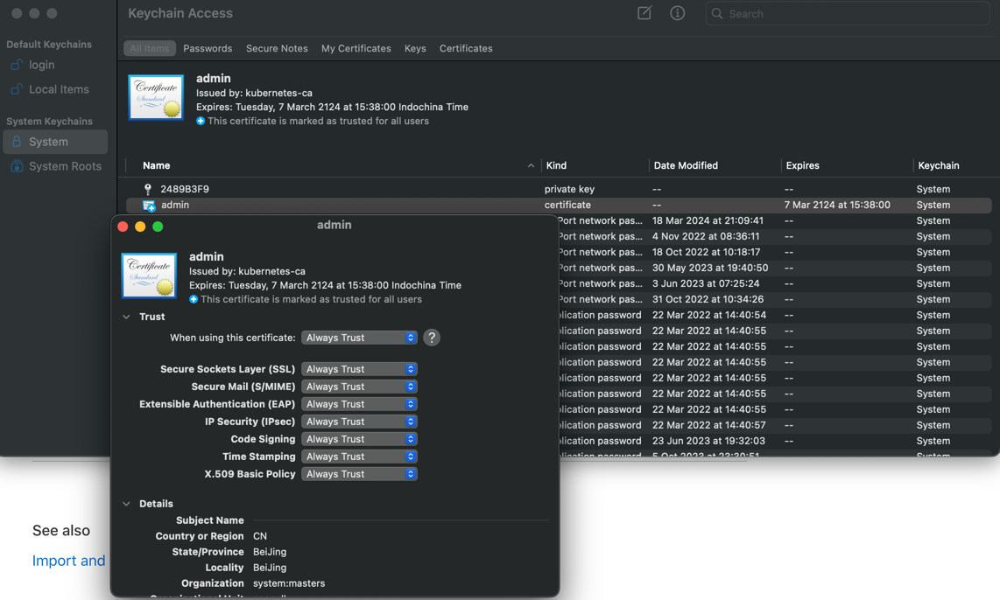
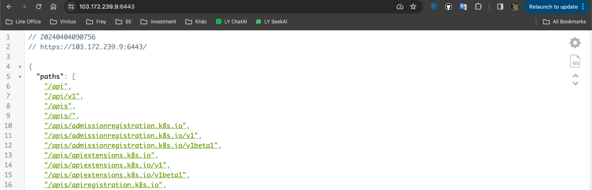

# A. Browser access kube-apiserver secure port

When the browser accesses the secure port 6443 of kube-apiserver, it prompts that the certificate is not trusted:


This is because the server certificate of kube-apiserver is signed by the root certificate ca.pem we created. The root certificate ca.pem needs to be imported into the operating system and permanent trust set up.

For Mac, do this:



For windows systems, use the following command to import ca.perm:

``` bash
keytool -import -v -trustcacerts -alias appmanagement -file "PATH...\\ca.pem" -storepass password -keystore cacerts
```

Visit [apiserver address](https://103.172.239.9:6443/) again, it is trusted, but it prompts 401, unauthorized access:


We need to generate a client certificate for the browser and use it when accessing the 6443 https port of apiserver.

Here we use the admin certificate, private key and the above ca certificate created when deploying the kubectl command line tool to create a certificate that the browser can use in PKCS#12/PFX format:

``` bash
$ openssl pkcs12 -export -out admin.pfx -inkey admin-key.pem -in admin.pem -certfile ca.pem
```

Import the created admin.pfx into the system's certificate. For Mac, do this:



**Restart the browser**, visit [apiserver address](https://103.172.239.9:6443/) again, you will be prompted to select a browser certificate, here select the admin.pfx imported above:


This time, access is granted to the secure port of kube-apiserver:



## The principle of client selection certificate

1. Certificate selection is agreed upon during the SSL/TLS handshake negotiation phase between client and server;
1. If the server requires the client to provide a certificate, it will send a list of CAs it accepts to the client during the handshake;
1. The client looks up its certificate list (generally the operating system certificate, keychain for Mac) to see if there are certificates signed by the CA. If so, provide them to the user for selection (the private key of the certificate);
1. The user selects a certificate private key, and the client will use it to communicate with the server;


## Reference
+ https://github.com/kubernetes/kubernetes/issues/31665
+ https://www.sslshopper.com/ssl-converter.html
+ https://stackoverflow.com/questions/40847638/how-chrome-browser-know-which-client-certificate-to-prompt-for-a-site
