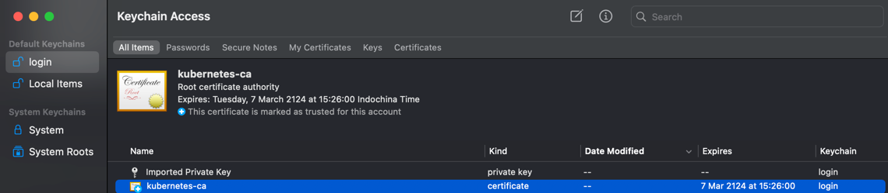

tags: access guidelines

# G. Access guidelines

## Access kube-apiserver secure port

When the browser accesses the secure port 6443 of kube-apiserver, it prompts that the certificate is not trusted

This is because the server certificate of kube-apiserver is signed by the root certificate ca.pem we created. The root certificate ca.pem needs to be imported into the operating system and permanent trust set up.

For Mac, do this:



For windows systems, use the following command to import ca.perm:

``` bash
keytool -import -v -trustcacerts -alias appmanagement -file "PATH...\\ca.pem" -storepass password -keystore cacerts
```

Visit [apiserver address](https://103.172.239.9:6443/) again, it is trusted, but it prompts 401, unauthorized access

We need to generate a client certificate for the browser and use it when accessing the 6443 https port of apiserver.

Here we use the admin certificate, private key and the above ca certificate created when deploying the kubectl command line tool to create a certificate that the browser can use in PKCS#12/PFX format:

``` bash
$ openssl pkcs12 -export -out admin.pfx -inkey admin-key.pem -in admin.pem -certfile ca.pem
```

Import the created admin.pfx into the system's certificate. For Mac, do this:


**Restart the browser**, visit [apiserver address](https://103.172.239.9:6443/) again, you will be prompted to select a browser certificate, select the `admin.pfx` imported above

This time, access is granted to the secure port of kube-apiserver:


## Access dashboard plug-in
```bash
ssh 'root@103.172.239.9'
```
Start port forwarding:

``` bash
kubectl port-forward -n kubernetes-dashboard  svc/kubernetes-dashboard 4443:443 --address 0.0.0.0
```

Browser access URL: `https://103.172.239.9:4443`


- by kuberconfig: [dashboard.kubeconfig](dashboard.kubeconfig)
- by token:
  -  `[root@idc-k8s-01 ~]# echo ${DASHBOARD_LOGIN_TOKEN}`


## Access monitoring plug-in
### Access Prometheus UI
```bash
ssh 'root@103.172.239.9'
```
Start the service agent:

``` bash
$ kubectl port-forward --address 0.0.0.0 pod/prometheus-k8s-0 -n monitoring 9090:9090
Forwarding from 0.0.0.0:9090 -> 9090
```
+ port-forward depends on socat.

Browser access：http://103.172.239.9:9090/graph?g0.range_input=1m&g0.expr=instance%3Anode_cpu_utilisation%3Arate1m&g0.tab=0


### Access Grafana UI
```bash
ssh 'root@103.172.239.9'
```
Start the agent:

``` bash
$ kubectl port-forward --address 0.0.0.0 svc/grafana -n monitoring 3000:3000 
Forwarding from 0.0.0.0:3000 -> 3000
```

Browser access: http://103.172.239.9:3000/d/efa86fd1d0c121a26444b636a3f509a8/kubernetes-compute-resources-cluster?orgId=1&refresh=10s

Log in with admin/admin:
```
admin
1Dc@123@idc2024
```
Then, you can see various predefined dashboards:


## Access kibana through kubectl proxy

Create a proxy:

``` bash
$ kubectl proxy --address='103.172.239.9' --port=8086 --accept-hosts='^*$'
Starting to serve on 103.172.239.91:8086
```

Browser access URL: http://103.172.239.9:8086/api/v1/namespaces/kube-system/services/kibana-logging/proxy
    
Create an index (equivalent to a database in mysql) on the Management -> Indices page, select `Index contains time-based events`, use the default `logstash-*` pattern, and click `Create`;


After creating the Index, wait a few minutes and you can see the logs aggregated in ElasticSearch logging under the `Discover` menu;


